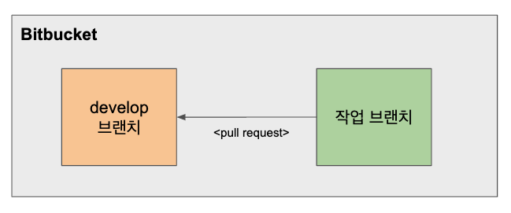
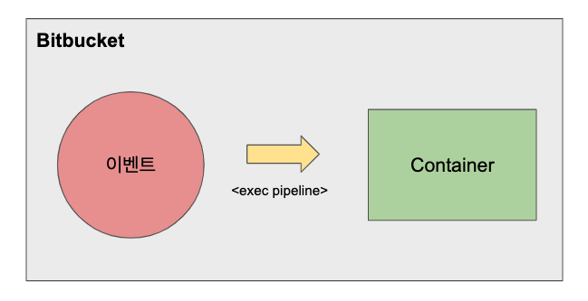

# Overview
Bitbucket Pipeline을 이용해서 Python용 CI 서버 구축

# Environments
* Python 3.5
* Mysql 5.6
* Custom Docker Image
* Bitbucket Pipeline

# 사용자 시나리오
 
* 작업 브랜치를 develop 브랜치로 pull request
* 관리자 승인 및 merge
* merge 된 develop 브랜치로 CI 진행

# CI 내용
* python dependency 체크
* code style 체크(PEP8)
* TDD

# CI 시스템 구성
 
* 이벤트 :
  * Bitbucket 내 commit 또는 push 이벤트가 발생하면 Container를 생성하고 Pipeline 실행
  * Container는 Pipeline에 정의된 이미지 사용
  * commit/push 이벤트 뿐만 아니라 스케줄링도 가능
* Pipeline :
  * CI 내용 정의
* Container :
  * CI가 실행되는 docker 환경
  * custom docker image
  * python3.5, mysql5.6 등의 설치

# Reference
* http://www.nextree.co.kr/p10799/
